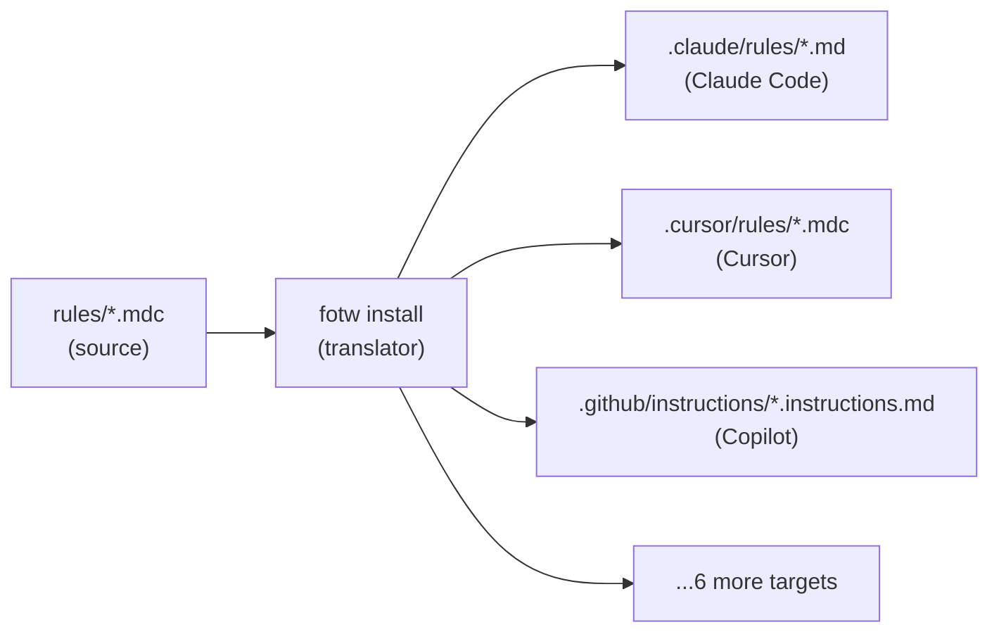
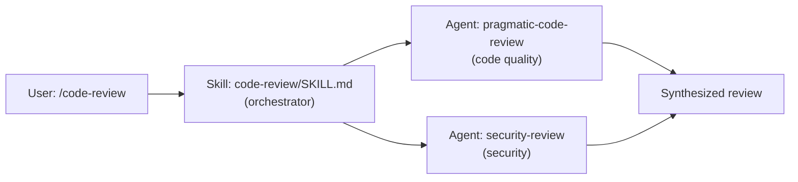

# Fellowship of the Workflows

A centralized repository for sharing AI agent workflows across your team. Works with Claude Code, Cursor, Copilot, Codex, Windsurf, Gemini, Roo, Goose, and more.

## What's Inside

| Type | Count | Description |
|------|-------|-------------|
| **Skills** | 44 core + 11 community | Executable packages — code review, Terraform, AWS, security audits, and more |
| **Rules** | 20 core + 8 community | Conditional context files — git safety, output style, model guidance, coding patterns |
| **Agents** | 20 core + 15 community | Subagent definitions — specialist agents for focused tasks |
| **Hooks** | 5 | Claude Code event hooks — block dangerous commands, guard branches |
| **Personas** | 12 | AI personality overlays — Gandalf, Sauron, and friends |
| **Starters** | 3 | Project templates — minimal, standard, full |

All workflows are authored once and automatically translated to each tool's native format on install.

---

## Philosophy

**Single-source, multi-target.** Author a workflow once in a tool-agnostic format. Install it to any of 9 AI tools without maintaining 9 copies. When the workflow improves, update one file and re-sync.

**Least-privilege by default.** Skills declare exactly which tools they need — no more. A read-only code review skill cannot run `git push`. A commit-generating skill cannot `git reset --hard`. The validator enforces this.

**Phase-scoped context for token efficiency.** Complex skills can declare which files are relevant to each phase (discover, plan, implement). Only the files needed for the current phase are loaded into context — keeping prompts tight.

**Workflow authoring as engineering.** Skills have golden tests. The plan validator is a linter for PLAN.md files. Breaking changes in rules are caught by translation tests. The same discipline applied to production code applies to the workflows that guide it.

---

## How It Works

### The Translation Pipeline

Rules are authored in Cursor `.mdc` format — a superset of Markdown with YAML frontmatter. When you run `fotw install`, the translator rewrites the frontmatter for the target tool: `globs` becomes `paths` for Claude Code, `applyTo` for Copilot, and the frontmatter is stripped entirely for tools that only support plain Markdown. The rule body is preserved exactly. One source, many targets.



### Plugin Mode vs Install Mode

**Plugin mode** loads the entire repo as a Claude Code plugin in one command. Skills and agents are auto-discovered and available immediately as slash commands. This is the fastest way to get started — no per-workflow installation needed. Rules and starters are not auto-discovered because they need to live inside your project's config directory; use `fotw setup` to install them.

**Install mode** copies individual workflows into a target project, translating format as needed. Use this for non-Claude tools, for selecting specific workflows, or for distributing workflows to teammates who use different tools.

### Skills, Agents, and Execution

A skill (`/code-review`) is an instruction document that tells Claude how to perform a task. An agent (`agents/pragmatic-code-review.md`) is a specialist subprocess that performs the task in isolation. Skills and agents are complementary: a skill may invoke one or more agents to execute focused sub-tasks, then synthesize the results.



---

## Quick Start

There are two ways to use this repo:

| | Plugin Mode | Install Mode |
|---|---|---|
| **How** | Load directly as a Claude Code plugin | Copy workflows into your project |
| **Tools** | Claude Code only | All 9 tools |
| **Components** | Skills, agents, hooks (auto) · Rules, starters (manual) | Skills, agents, rules, starters, personas |
| **Setup** | One command | Per-workflow install |

### Option A: Claude Code Plugin (fastest)


```bash
# One-time: register the marketplace (inside Claude Code)
/plugin marketplace add TrevorEdris/fellowship-of-the-workflows

# Install the plugin
/plugin install fotw@fellowship-of-the-workflows

# Or load directly for a single session (requires local clone)
claude --plugin-dir /path/to/fellowship-of-the-workflows
```

All 44 core skills, 34 agents, and 5 hooks are auto-discovered. Use `/code-review`, `/terraform`, `/security-review`, etc. immediately.

> **Community skills** are not auto-discovered. Install them explicitly: `fotw install community/azure ~/project --for claude-code`

> **Rules and starters** still need `fotw setup` or `fotw install` — they must live in your project directory. Use `fotw setup ~/my-project --for claude-code` to install all rules with lock file tracking. See [Option B](#option-b-install-mode-any-tool).

### Option B: Install Mode (any tool)


```bash
# 1. Clone and set up the CLI
git clone https://github.com/TrevorEdris/fellowship-of-the-workflows.git
cd fellowship-of-the-workflows
./bin/bootstrap                    # Creates a project-local Python venv (3.10+ required)

# 2. See what's available
./bin/fotw list                    # Everything
./bin/fotw list --type skill       # Just skills
./bin/fotw list --tier core        # Core skills only
./bin/fotw list --tier community   # Community (vendor-specific) skills
./bin/fotw list --tag aws          # Skills tagged "aws"

# 3. Install a starter template to your project
./bin/fotw install starters/standard ~/my-project --for claude-code

# 4. Install individual workflows
./bin/fotw install skills/code-review ~/my-project --for claude-code
./bin/fotw install community/azure ~/my-project --for claude-code
./bin/fotw install rules/ai-session ~/my-project --for cursor
./bin/fotw install rules/git-safety --global --for claude-code   # Available in all projects
```

> **Which `--for` value do I use?** See [Supported Tools](#supported-tools) below.

---

## Commands

| Command | Description |
|---------|-------------|
| `./bin/bootstrap` | Set up the CLI environment (Python 3.10+ required) |
| `./bin/fotw list` | List available workflows |
| `./bin/fotw install` | Deploy a workflow or starter to a project |
| `./bin/fotw setup` | Install all rules to a project with lock file tracking |
| `./bin/fotw update` | Re-sync installed rules after upstream changes |
| `./bin/fotw new` | Create a new workflow from template |
| `./bin/fotw validate` | Validate workflow files |

Run any command with `--help` for full options.

### Install Options

```bash
./bin/fotw install skills/code-review ~/my-project --for claude-code          # To a project
./bin/fotw install community/pulumi ~/my-project --for claude-code             # Community skill
./bin/fotw install rules/ai-session --global --for cursor                     # Global (all projects)
./bin/fotw install --all ~/my-project --for claude-code --force               # Everything at once
./bin/fotw install skills/code-review ~/my-project --for claude-code --dry-run  # Preview only
```

| Flag | Description |
|------|-------------|
| `--for <tool>` | **Required.** Target tool (see table below) |
| `--global` / `-g` | Install to `~/.<tool>/` (available in all projects) |
| `--all` / `-a` | Install all workflows at once |
| `--force` / `-f` | Overwrite without prompting |
| `--dry-run` / `-n` | Preview what would be installed |
| `--tier core\|community\|all` | Filter skill listing by tier |

Without `--force`, the installer prompts before overwriting: `[o]verwrite / [s]kip / [d]iff / [b]ackup / [O]verwrite-all / [S]kip-all / [q]uit`.

### Supported Tools

| Tool | `--for` value | Config directory | Rule extension |
|------|---------------|------------------|----------------|
| Claude Code | `claude-code` | `.claude/` | `.md` |
| Cursor | `cursor` | `.cursor/` | `.mdc` |
| GitHub Copilot | `copilot` | `.github/` | `.instructions.md` |
| OpenAI Codex | `codex` | `.codex/` | `.md` |
| Windsurf | `windsurf` | `.windsurf/` | `.md` |
| Gemini Code Assist | `gemini` | `.gemini/` | `.md` |
| Roo Code | `roo` | `.roo/` | `.md` |
| Goose | `goose` | `.goose/` | `.md` |
| Universal | `universal` | `.ai/` | `.md` |

Use `--for both` to install for both Claude Code and Cursor simultaneously.


---

## Starter Templates

Starters give you a ready-made project config file with bundled rules.

```bash
./bin/fotw install starters/standard ~/my-project --for claude-code  # → CLAUDE.md
./bin/fotw install starters/standard ~/my-project --for cursor       # → AGENTS.md
./bin/fotw install starters/standard ~/my-project --for copilot      # → AGENTS.md + .github/instructions/
```

| Tier | Description | Bundled Rules |
|------|-------------|---------------|
| `minimal` | Git safety, output style (~20 lines) | `git-safety`, `output-style` |
| `standard` | + 5-phase QRSPI workflow (~40 lines) | + `discover-plan-implement`, `ai-session` |
| `full` | + Persona system (12 characters), multi-repo safety (~50 lines) | + `multi-repo-safety`, `persona-integration` + all personas |

See [starters/README.md](starters/README.md) for details and modular snippets.

---

## Skill Tiers

Skills are organized into two tiers:

| Tier | Location | Audience | Plugin Auto-Discovery |
|------|----------|----------|-----------------------|
| **Core** | `skills/` | Universal (any stack) | Yes |
| **Community** | `community/` | Specific vendor or niche | No — explicit install only |

Community skills follow the same quality bar as core skills — the distinction is audience, not quality. See [community/README.md](community/README.md) for the full list and installation instructions.

### Skill Tags

Use `./bin/fotw list --tag <tag>` to filter.

| Tag | Description |
|-----|-------------|
| `architecture` | System design, API design, patterns, databases |
| `infrastructure` | IaC, provisioning, containers, cloud resources |
| `documentation` | Docs generation, writing, diagrams |
| `meta` | Agent self-management, session tools, orchestration |
| `review` | Code, design, security, or performance review |
| `incident-response` | Alerting, on-call, incident management |
| `aws` | Amazon Web Services |
| `gcp` | Google Cloud Platform |
| `azure` | Microsoft Azure |
| `observability` | Monitoring instrumentation, dashboards, SLOs |
| `security` | Security hardening, IAM, vulnerability analysis |
| `testing` | TDD, E2E, test scaffolding, debugging |
| `ci-cd` | CI/CD pipelines, deployment automation |
| `git` | Git workflows, branching, PRs, commits |
| `go` | Go language patterns |
| `python` | Python language patterns |
| `rust` | Rust language patterns |
| `typescript` | TypeScript language patterns |

**Full skill listing:** [docs/CATALOG.md](docs/CATALOG.md)

---

## Workflow Types

| Type | Storage | Description |
|------|---------|-------------|
| **Skills** | `skills/<name>/SKILL.md` | Executable packages ([Agent Skills](https://agentskills.io) standard) |
| **Rules** | `rules/*.mdc` | Conditional context files (Cursor format, auto-translated on install) |
| **Agents** | `agents/*.md` | Subagent definitions with tool restrictions |
| **Hooks** | `hooks/*.js` | Claude Code hook scripts (Claude Code only) |

Rules are authored in Cursor `.mdc` format and automatically translated to each tool's native format on install.

---

## Hooks (Claude Code only)

Hooks are Node.js scripts that intercept Claude Code events at runtime — blocking dangerous commands, protecting secrets, guarding branches, etc.

```bash
./bin/fotw list --type hook                                          # List available hooks
./bin/fotw install hooks --global --for claude-code                 # Install all hooks globally
./bin/fotw install hooks/branch-guard --global --for claude-code    # Install a single hook
./bin/fotw install hooks --global --for claude-code --include-tests # With test files
./bin/fotw install hooks --global --for claude-code --dry-run       # Preview only
```

Hooks require `--global` and `--for claude-code`. The installer copies scripts to `~/.claude/hooks/` and merges hook configuration into `~/.claude/settings.json` (with backup).

---

## Claude Code Plugin Architecture

This repo is structured as a [Claude Code plugin](https://code.claude.com/docs/en/plugins-reference). When loaded via `claude --plugin-dir` or `claude plugin install`, Claude Code auto-discovers:

| Component | Location | Discovery |
|-----------|----------|-----------|
| Skills | `skills/*/SKILL.md` | Auto — available as `/skill-name` slash commands |
| Agents | `agents/*.md` | Auto — Claude invokes based on task context |
| Hooks | `hooks/hooks.json` | Auto — registered as event handlers |
| Rules | `rules/*.mdc` | **Manual** — requires `fotw install` to copy to project |
| Starters | `starters/*.md` | **Manual** — requires `fotw install` to copy to project |
| Community skills | `community/*/SKILL.md` | **Manual** — excluded from auto-discovery |
| Community rules | `community/rules/*.mdc` | **Manual** — excluded from auto-discovery |
| Community agents | `community/agents/*.md` | **Manual** — excluded from auto-discovery |

The `.claude-plugin/plugin.json` manifest declares the plugin metadata. Hook scripts use `${CLAUDE_PLUGIN_ROOT}` to resolve paths relative to the plugin directory.

---

## Contributing

See [CONTRIBUTING.md](CONTRIBUTING.md) for guidelines on adding new workflows.

## License

MIT
