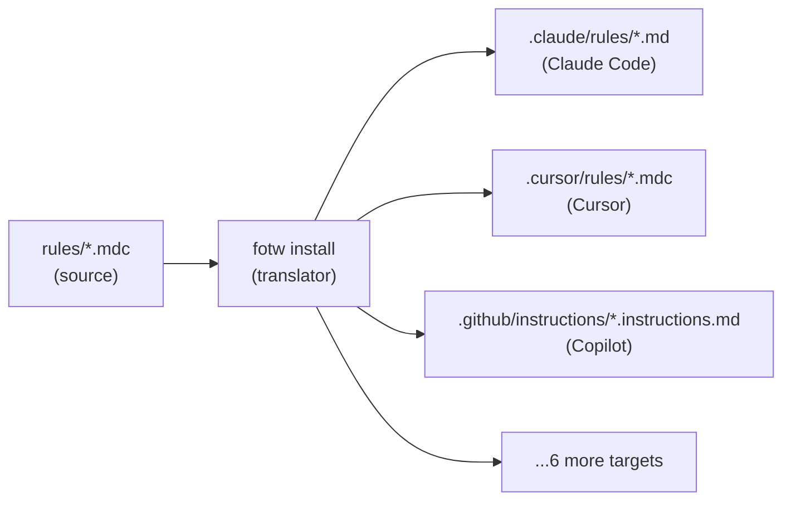
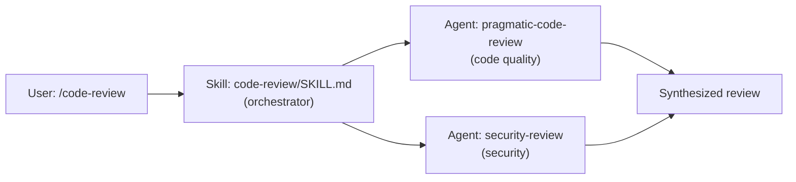

# Architecture

[← README](../README.md)

This document covers the internal design of Fellowship of the Workflows — the translation pipeline, plugin architecture, and workflow type system.

---

## The Translation Pipeline

Rules are authored in Cursor `.mdc` format — a superset of Markdown with YAML frontmatter. When you run `fotw install`, the translator rewrites the frontmatter for the target tool: `globs` becomes `paths` for Claude Code, `applyTo` for Copilot, and the frontmatter is stripped entirely for tools that only support plain Markdown. The rule body is preserved exactly. One source, many targets.



Translation is handled by `cli/fotw/services/frontmatter_translator.py`:
- **Claude Code:** `globs` → `paths` (array), `alwaysApply: true` → `paths: ["**/*"]`, body `.mdc` refs → `.md`
- **Copilot:** `globs` → `applyTo` (string), `alwaysApply: true` → `applyTo: "**"`, body `.mdc` refs → `.instructions.md`
- **Generic** (codex, windsurf, gemini, roo, goose, universal): frontmatter stripped to description only

---

## Skills, Agents, and Execution

A skill (`/code-review`) is an instruction document that tells Claude how to perform a task. An agent (`agents/pragmatic-code-review.md`) is a specialist subprocess that performs the task in isolation. Skills and agents are complementary: a skill may invoke one or more agents to execute focused sub-tasks, then synthesize the results.



---

## Plugin Mode vs Install Mode

**Plugin mode** loads the entire repo as a Claude Code plugin in one command. Skills and agents are auto-discovered and available immediately as slash commands. This is the fastest way to get started — no per-workflow installation needed. Rules are not auto-discovered because they need to live inside your project's config directory; use `fotw setup` to install them.

**Install mode** copies individual workflows into a target project, translating format as needed. Use this for non-Claude tools, for selecting specific workflows, or for distributing workflows to teammates who use different tools.

---

## Workflow Types

| Type | Storage | Description |
|------|---------|-------------|
| **Skills** | `skills/<name>/SKILL.md` | Executable packages ([Agent Skills](https://agentskills.io) standard) |
| **Rules** | `rules/*.mdc` | Conditional context files (Cursor format, auto-translated on install) |
| **Agents** | `agents/*.md` | Subagent definitions with tool restrictions |
| **Hooks** | `hooks/*.js` | Claude Code hook scripts (Claude Code only) |

Rules are authored in Cursor `.mdc` format and automatically translated to each tool's native format on install.

---

## Claude Code Plugin Architecture

This repo is structured as a [Claude Code plugin](https://code.claude.com/docs/en/plugins-reference). When loaded via `claude --plugin-dir` or `claude plugin install`, Claude Code auto-discovers:

| Component | Location | Discovery |
|-----------|----------|-----------|
| Skills | `skills/*/SKILL.md` | Auto — available as `/skill-name` slash commands |
| Agents | `agents/*.md` | Auto — Claude invokes based on task context |
| Hooks | `hooks/hooks.json` | Auto — registered as event handlers |
| Rules | `rules/*.mdc` | **Manual** — requires `fotw install` to copy to project |
| Personas | `personas/*.md` | **Manual** — requires `fotw install personas` |
| Output styles | `output-styles/persona-*.md` | Auto — shipped in the plugin, selectable in `/config` |
| Language skills/rules | `languages/` | **Manual** — excluded from auto-discovery |
| Platform skills/rules/agents | `platforms/` | **Manual** — excluded from auto-discovery |
| Vendor skills/rules/agents | `vendors/` | **Manual** — excluded from auto-discovery |

The `.claude-plugin/plugin.json` manifest declares the plugin metadata. Hook scripts use `${CLAUDE_PLUGIN_ROOT}` to resolve paths relative to the plugin directory.

---

## Dynamic Context Injection

Skills can embed live command output using `` !`command` `` syntax:
```markdown
Current branch:
\```
!`git branch --show-current`
\```
```

The command executes at skill invocation, injecting results into the prompt.

---

## Phase-Scoped Context

Skills can declare which reference files are relevant to each phase (discover, plan, implement) via a `context-manifest` in their SKILL.md frontmatter. Only the files needed for the current phase are loaded into context, keeping prompts tight.

---

## Persona System

A persona gives the assistant an in-character voice (Gandalf, Spock, Rocky, …) without changing what it does. The system has three layers. `persona.yaml` is the single runtime source of truth; the other two layers are derived from it and exist only to make activation more reliable on Claude Code.

| Layer | Mechanism | Tools | Role |
|-------|-----------|-------|------|
| 1. Rule + config | `rules/persona-integration.mdc` reads `.<tool>/persona.yaml` (`persona`, `intensity`) | All 9 | Source of truth; takes effect on the next message |
| 2. Output style | `output-styles/persona-<name>.md`, activated via `outputStyle` in `.claude/settings.local.json` | Claude Code | Puts the voice in the **system prompt** with adherence reminders, so it survives context compaction |
| 3. Spinner verbs | `spinnerVerbs` (replace mode) in `.claude/settings.local.json` | Claude Code | In-character spinner words ("Consulting the Palantír…", "Bumping fists…") |

### Single source, derived artifacts

Each persona is authored once as `personas/<name>.md`. The output style is **generated**, never hand-edited:

```bash
fotw generate output-styles    # personas/*.md -> output-styles/persona-*.md
```

Generation is pure positional extraction (no model calls), so CI verifies the committed `output-styles/` byte-for-byte against a fresh run. Editing a persona without regenerating fails the freshness test. Spinner verbs live in a `## Spinner Verbs` section at the end of each persona file; other tools ignore it.

Generated styles are self-sufficient (they never reference `personas/` on disk, which plugin-only installs lack) and defer to `persona.yaml` for both identity and intensity — if the config names a different persona or `intensity: off`, the style stands down. Styles always set `keep-coding-instructions: true` (so engineering behavior is unchanged) and never set `force-for-plugin` (so the plugin never overrides the user's own style choice).

### Activation and timing

`fotw install personas --for claude-code` (or the `/switch-persona` skill) symlinks the styles into `.claude/output-styles/` and, when a persona is already configured, writes `outputStyle` + `spinnerVerbs` into `settings.local.json`. The user's prior values are recorded in `persona.yaml` (`previous-output-style`, `previous-spinner-verbs`) and restored on `/switch-persona off` or `fotw uninstall personas`.

The rule layer changes voice on the next message; the output style and spinner verbs load when the system prompt is rebuilt — after `/clear` or a new session. The `persona-context.js` SessionStart hook injects the active persona and intensity deterministically so activation never depends on the model remembering to read the config.

When the fotw plugin is enabled, project-level style installs are skipped — the plugin already ships the styles, and duplicate names would collide in the `/config` picker.
